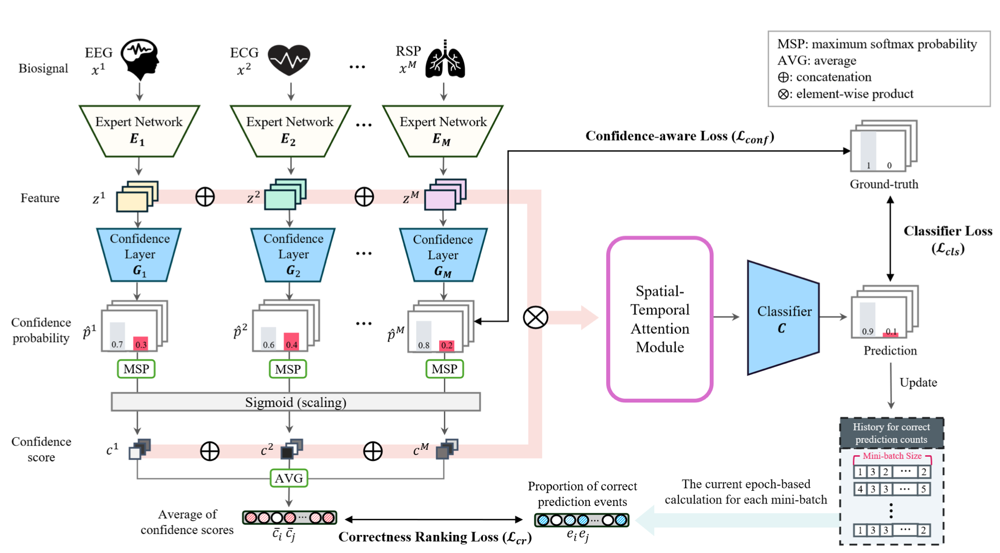

# Dynamic Multi-Biosignal Fusion (DMBF)
S.-H. Park et al., "Dynamic Multi-biosignal Fusion for Detecting the Mental States of Drivers and Passengers in Vehicles," Journal of Biomedical and Health Informatics (under review), 2024. 

## Overview
DMBF is an innovative framework designed for detecting the mental states of drivers and passengers in vehicles. By leveraging multi-modal biosignals such as EEG, ECG, and PPG, the DMBF method provides a robust and reliable solution for real-time mental state monitoring. This approach utilizes a dynamic gate mechanism and spatial-temporal attention to achieve superior classification performance across various scenarios, including motion sickness, drowsiness, and sustained attention.



## Key Features
- **Dynamic Fusion**: Adjusts biosignal contributions based on data quality and informativeness, ensuring robust performance.
- **Spatial-Temporal Attention Module (STAM)**: Captures key signal patterns over time and across channels.
- **Confidence-Aware Learning**: Incorporates reliability estimation into model training, enhancing prediction accuracy.
- **Versatile Application**: Validated on datasets spanning motion sickness, distraction, drowsiness, and more.
- **High Performance**: Outperforms static fusion and traditional dynamic models on various biosignal-based datasets.

## Technologies Used
- **Programming Language**: Python
- **Deep Learning Framework**: PyTorch
- **Key Models**: EEGNet, Confidence-Aware Mechanisms, Attention-Based Fusion
- **Dataset Sources**: Multi-modal biosignal datasets including motion sickness, sustained attention, and driver distraction data.

## Installation & Usage
### Prerequisites
- Python 3.7 or later
- PyTorch 1.8.0+
- CUDA Toolkit for GPU acceleration (if available)
- Required Python packages (e.g., numpy, scipy, matplotlib)

### Installation
Clone the repository and install the dependencies:
```bash
git clone https://github.com/seohyeoning/DMBF.git
cd DMBF
pip install -r requirements.txt
```

### Running the Model
1. Prepare your biosignal dataset as per the required format (see `data_preprocessing` folder for guidance).
2. Train the DMBF model:
   ```bash
   python train.py --dataset <dataset_name> --epochs 100
   ```
3. Evaluate the trained model:
   ```bash
   python evaluate.py --model <model_path> --test_data <test_dataset_path>
   ```

## Project Structure
```
DMBF/
├── Baseline_models/      # Contains baseline implementations
├── DMBF_Ablation/        # Code for ablation studies
├── DMBF_Ours/            # Core implementation of the DMBF framework
├── Qualitative_study/    # Scripts for qualitative analysis
├── data_preprocessing/   # Data preparation scripts
├── requirements.txt      # Required Python libraries
├── train.py              # Training script
├── evaluate.py           # Evaluation script
└── README.md             # Project documentation
```

## Results
DMBF has been extensively validated across multiple datasets, achieving significant performance improvements over baseline models:
- Motion Sickness: F1-score = 0.5569
- Drowsiness: F1-score = 0.7187
- Distraction: F1-score = 0.6647
- Sustained Attention: F1-score = 0.8092

The framework demonstrates consistent generalizability and robustness in detecting diverse mental states.

## Contribution Guidelines
We welcome contributions to enhance the DMBF framework! To contribute:
1. Fork the repository.
2. Create a new branch (`git checkout -b feature/YourFeature`).
3. Commit your changes (`git commit -m 'Add a new feature'`).
4. Push to the branch (`git push origin feature/YourFeature`).
5. Open a Pull Request and describe your changes.

## License
This project is licensed under the MIT License. See the `LICENSE` file for details.

---

For any questions or suggestions, feel free to open an issue or contact the contributors.
